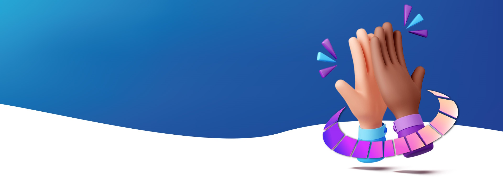

# Supplement Solutions - Landing Page Premium

 <!-- Puedes cambiar la imagen de banner si lo deseas -->

Este proyecto es la página web corporativa para **Supplement Solutions**, desarrollada como parte del periodo de Estadías Profesionales. Supplement Solutions es una marca mexicana especializada en la conceptualización, formulación, producción y envasado de suplementos alimenticios para emprendedores y marcas que buscan servicios de maquila integral.

## 📌 Descripción del Proyecto

El objetivo principal de este proyecto fue diseñar y desarrollar una *Landing Page* profesional y dinámica que comunicara los servicios, los valores de la empresa y los esquemas de paquetes (Premium, Básicos, etc.) disponibles para los clientes. 

El código original fue mejorado significativamente para transicionar de una plantilla estática de Bootstrap a una experiencia **Premium**, introduciendo:
- **Diseño Moderno**: Efectos tipo *Glassmorphism* (panel de vidrio esmerilado).
- **Animaciones Fluidas**: Detección de scroll con `IntersectionObserver` para lograr componentes que se desvanecen hacia arriba (`fade-up`) y micro-interacciones.
- **Tipografía y Jerarquía Visual**: Uso combinado de Montserrat (para fuerza visual en los encabezados) e Inter (para lecturabilidad) en lugar de las fuentes estándar.

## 🛠️ Tecnologías y Herramientas Utilizadas

- **HTML5 & CSS3**: Estructura sólida y estilizado moderno (Variables, Gradients, Box Shadows, Backdrop Filter).
- **JavaScript (Vanilla)**: Lógica principal para observadores de intersección y sliders automáticos.
- **Bootstrap 5**: Framework CSS utilizado como base para la grilla responsiva (y modificado con variables presonalizadas en `custom.css`).
- **Slick Carousel**: Implementación fluida de carruseles de productos.
- **PHP**: Back-end simple destinado a la recolección de leads (vía `send_email.php`).
- **FontAwesome**: Iconografía en todo el sistema.

## 📁 Estructura del Proyecto

```text
/
├── assets/
│   ├── css/          # Archivos de estilos (Bootstrap, custom.css, OurProceso.css)
│   ├── img/          # Logotipos, fondos, íconos y banners del proyecto
│   ├── js/           # Scripts de terceros e integraciones
│   └── webfonts/     # Fuentes para los iconos locales
├── index.html        # Página principal de la marca y visión general
├── about.html        # Página sobre "Quiénes Somos" y la misión/visión
├── premium.html      # Página detallada de esquema Premium
├── ultrapremium.html # Página detallada de paquete Ultra Premium
├── shop-single.html  # Página referente al paquete básico
├── contact.html      # Formulario de contacto hacia la empresa
├── animation.js      # Lógica Custom JS para la interacción visual (scroll, sliders)
└── send_email.php    # (Opcional) Script receptor para mensajes
```

## 👨‍💻 Contexto Académico / Profesional

Este repositorio guarda los entregables y el código fuente documentando el trabajo práctico realizado durante las Estadías Profesionales. Refleja la aplicación de conocimientos en desarrollo web front-end, diseño UI/UX y optimización de interacción con el usuario en un entorno corporativo vivo.

## 🚀 Cómo Inicializar el Proyecto

Al ser primariamente un conjunto estático de Front-End, no requiere de una instalación compleja.
1. ¡Clona el repositorio!
2. Abre `index.html` con cualquier navegador web moderno.
3. *Nota*: Para que `send_email.php` funcione, el proyecto debe montarse utilizando un servidor apache local (como XAMPP, WAMP o Laragon) o un servidor web.

---
*Hecho por Jaiel Ortiz & Jorge Matu para Supplement Solutions.* 
